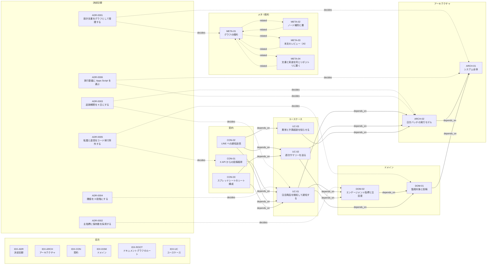

# gacha-monitor

X の 1 アカウントの投稿を毎日追跡し、**保存数（ブックマーク数）が閾値を超えた投稿**を
LINE で担当者に通知して、スプレッドシートに記録する。

用途は**販売店が注目商品を発売前に把握すること**。整理券・抽選・入荷調整・人員配置を
準備する時間を稼ぐための道具であり、混雑とトラブルを避けることが目的である。

- **実行基盤** Google Apps Script（[ADR-0006](docs/50-adr/adr-0006-apps-script-runtime.md)）
- **月額** 約 1,640 円（追跡 4 日・1 日 18 投稿での実測値からの試算）
- **受信する口を持たない。** 時刻起動で外へ出ていくだけの一方向で完結する

## 何を測っているか

**保存数**（あとで見返すために保存した人数）。表示回数ではない。

実測（自作投稿 91 件）で、保存数は最小 2 / 中央値 210 / 最大 7,347 と **3,674 倍**に散らばり、
表示数は 8.2 万 / 17.8 万 / 313 万で **38 倍**しか動かなかった。
**表示数はどこに閾値を引いても選別が効かない。**
判断の詳細は [ADR-0002](docs/50-adr/adr-0002-save-count-as-metric.md) にある。

## 通知

閾値は 3 段階。同じ投稿の同じ段階は二度通知されない。

| 保存数 | 印 | 実測の頻度 |
| --- | --- | --- |
| 500 以上 | （なし） | 5.2 件/日 |
| 1,000 以上 | `【要チェック】` | 2.2 件/日 |
| 2,000 以上 | `【要注意！！】` | 1.2 件/日 |

閾値超過が無い日は**何も送らない**。沈黙が正常か故障かは、週 1 回のサマリーで見分ける。

## 設計文書

<!-- graph:diagram:start -->

<!-- この図は render --into が生成する。手で編集しない -->



<!-- graph:diagram:end -->

| 層 | 入口 |
| --- | --- |
| アーキテクチャ | [ARCH-01 システム全体](docs/10-architecture/arch-01-system-overview.md) |
| ドメイン | [DOM-01 監視対象と投稿](docs/20-domain/dom-01-post.md) |
| ユースケース | [UC-01 注目商品を検知して通知する](docs/30-usecases/uc-01-detect-and-notify.md) |
| 契約 | [CON-01 X API からの投稿取得](docs/40-contracts/con-01-x-api-fetch.md) |
| 決定記録 | [ADR 一覧](docs/50-adr/index.md) |

文書はグラフとして管理され、リンク切れ・孤立・循環・層の逆流を CI が検証する。
規約は [docs/00-meta/graph-rules.md](docs/00-meta/graph-rules.md)。

```bash
python -m tools.graph check
```

## 実装

```
app/
  monitor.gs        本体。日次の取得・判定・記録・通知
  spike.gs          検証用。取得できるかと、指標の水準を 1 回だけ測る
  appsscript.json   マニフェスト
```

**リポジトリが正。** 配置は CI が行うので、**Apps Script の編集画面で直接書き換えない。**
書き換えても次の配置で消える。

| 関数 | 用途 |
| --- | --- |
| `setup()` | 3 シート作成・初期設定・時刻起動トリガーの作成。**導入時に 1 回だけ** |
| `dailyRun()` | 日次の本体。トリガーから呼ばれる |
| `dryRun()` | 通知を送らずに、閾値を超えている投稿を実行ログに出す。閾値の調整に使う |
| `diagnose()` | 動かないときの切り分け。トリガー・シート・設定の状態を出す |
| `testLineNotify()` | LINE の疎通確認 |

## 導入

**監視対象はリポジトリに書かない。** 設定シートの「監視アカウント」に入れる。

1. X の開発者アカウントを作り、Bearer Token を取得してクレジットをチャージする
2. LINE 公式アカウントを開設し、Messaging API のチャネルアクセストークンを取得する
3. スプレッドシートを作り、拡張機能 → Apps Script を開く
4. スクリプトプロパティに `X_BEARER_TOKEN` と `LINE_CHANNEL_TOKEN` を登録する
   （`LINE_USER_ID` は任意。未設定なら友だち全員宛で送る）
5. `setup()` を 1 回実行する
6. **設定シートの「監視アカウント」に X のユーザー名を入れる**（`@` は付けない）
7. `dailyRun()` を手で実行して動作を確認する

トリガーを作った当日は自動実行が回らないことがある。翌朝から動く。

## 運用

閾値と追跡日数は**設定シートで変える**。コードは触らない。
止めたいときは設定シートの「稼働」を無効にする。

**追跡日数を 1 日増やすと月額が約 410 円増える。**
費用は「1 日に読む別々の投稿の数」だけで決まり、取得の頻度を落としても下がらない
（[ARCH-02](docs/10-architecture/arch-02-daily-batch.md)）。

## 未確定の論点

**追跡 4 日で足りているかは、まだ分かっていない。**
4 日で打ち切る以上、5 日目以降の値は原理的に観測できない。

日次スナップショットが 2〜3 週間貯まったら、**追跡の最終日に保存数が閾値の 8 割前後に
達し、なお伸びていた投稿**が何件あったかを数える。相当数あれば追跡日数を延ばす。
詳細は [ADR-0003](docs/50-adr/adr-0003-tracking-window.md)。

## ライセンス

MIT
